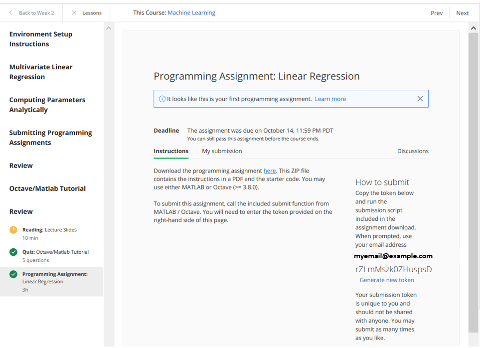
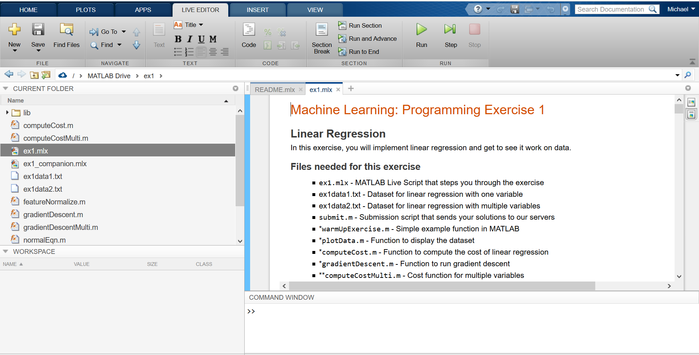
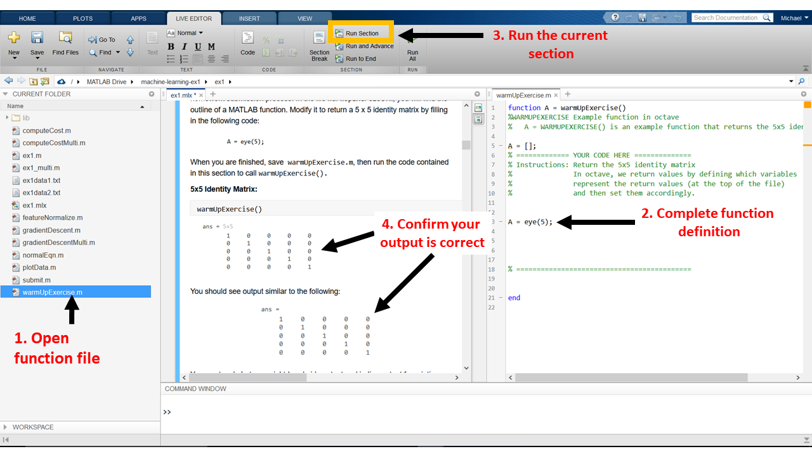
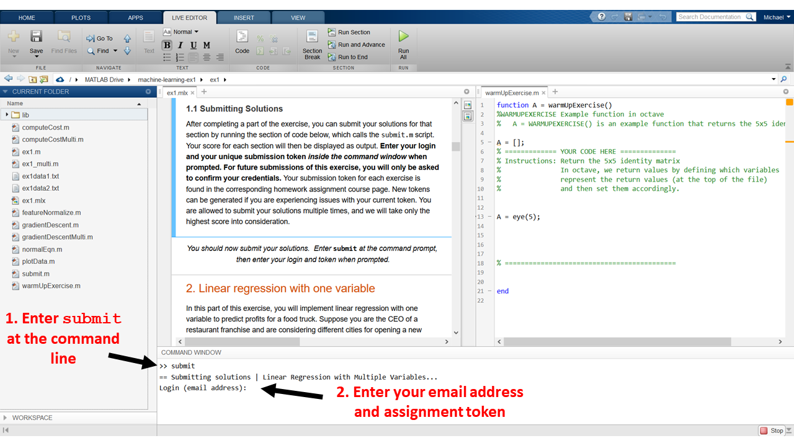
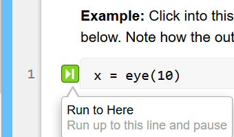

# Completing the Programming Exercises in MATLAB Online
# Introduction


The *Machine Learning* programming exercises have been updated by MathWorks for use with MATLAB Online. The original instructions and demonstrations in the course only apply to MATLAB desktop and Octave users. Therefore, it is important that you read and follow the instructions below before attempting a programming exercise in MATLAB Online. In the instructions that follow, is assumed that you are using the MATLAB Online trial license for *Machine Learning* and have accessed the exercise files using the link provided in Week 2.


# Initial setup


There are eight programming exercises. The first exercise is posted at the end of Week 2 and the exercise page is pictured below. Note the location of your assignment token and your Coursera email address, which are needed when submitting an assignment. 





When you reach a programming exercise page in the course, do not download the exercise. The necessary files for each exercise are contained in the 'machine-learning-ex' folder along with this script. To begin a programming exercise, right-click the corresponding exercise folder inside of the machine-learning-ex folder, and select 'Open':


You should then see the exercise files in the Current Folder browser along with the 'lib' folder which contains the submission functions (you should never edit any files in the 'lib' folder).


  


         


**Note**: 


   1.  It is important that you set your Current Folder to the exercise folder before working on the exercise, otherwise you may experience unexpected behavior and will not be able to submit.  
   1.  If you are logged out of MATLAB Online you will have to reset your Current Folder to the exercise folder before continuing to work on that exercise. 

# Completing a Programming Exercise
## Open the exercise script


To start the programming exercise, open the exercise script, ex*n*.mlx, where *n* is the exercise number. The exercise script contains instructions to guide you through the exercise as well as the necessary MATLAB code to load and visualize data and to test your functions. 


## Complete the function definitions


At several points in the exercise you will be prompted to open an existing function file and complete the function definition according to the instructions in the exercise script. After completing and saving the function file, you will usually be prompted to run a code section in the Live Script. The code will your function and compare your result with the expected output. An example of how to complete the first function file in ex1, `warmUpExercise.m`, is shown below:





## Submit your solutions


After testing your functions and confirming your output is correct, you will be prompted to submit your function for assessment. When you encounter the prompt below in the exercise script: 


   1.  Enter the command `submit` at the command prompt (>>) in the Command Window. 
   1.  Enter (or confirm) your Coursera email address and assignment token. **Note that each programming assignment has a unique token which is found in the assignment page in Coursera**. 


See the screen capture below for reference:





Your functions will be tested using different inputs and your scores will be displayed in the command window. You can submit your code multiple times- only your highest score will be saved.


# Running code sections inside a Live Script


The exercise scripts contain MATLAB code to load data, create visualizations, and call your completed functions. When you are prompted to run the code in a given section:


   1.  Click into the section to make it active. A blue bar will appear on the left. 
   1.  Click either the **Run Section (CTRL+ENTER)** or **Run and Advance (CTRL+SHIFT+ENTER) **buttons in the **Section** block of the **Live Editor** tab. Alternatively, you can click the blue bar. 


**Example:** Run the code in this section. You should see a 10x10 matrix of ones as output. Note that all output is contained within Live Scripts and not printed to the command window or separate figure windows.


```matlab:Code
x = ones(10)
```


When completing the programming exercises, you only need to run the code inside the exercise scripts and complete the included function files. You do not need to use the command window, except when submitting the exercise files. 


## Additional Tips for Running Code in Live Scripts

   -  Do not use the **Run **or **Run to End** buttons.  
   -  Do not execute the exercise scripts from the command line. 
   -  You may have to rerun one or more of the previous sections after addressing errors in your code or after accidentally clearing or overwriting the data variables.  
   -  You can also run all code up until a particular line by using the 'Run to Here' button, which appears when you hover the cursor to the left of an existing line of code, as in the screen capture below. Execution will be paused at that line. Press the 'Stop' button in the 'Live Editor' tab to return to normal execution. 





More advanced information on Live Script execution and code debugging can be found [here](https://www.mathworks.com/help/matlab/matlab_prog/debug-code-in-the-live-editor.html).


# Frequently Asked Questions


**Why do I receive an error regarding the Parallel Computing Toolbox when submitting?**


   -  Your Current Folder is not set correctly. See the Initial Setup instructions and make sure you complete step 4, which will ensure that your current folder is set to the exercise folder. Note that after you are logged out of MATLAB Online, you will have to reopen the exercise folder. 


**Why do I receive warnings about a missing 'lib' folder or errors about undefined functions when submitting?**


   -  Your exercise folder does not contain the files needed for submission. Follow the instructions in the Initial Setup section exactly- do not upload, move, copy or paste the exercise files individually. 


**Why don't I receive credit for a completed function when I submit, even though my output or plot is correct?**


   -  When you submit, your functions are tested using ***different inputs**** *from those in the exercise script. Your functions should be written to work with datasets of different sizes. Try the additional test cases for that function provided in the course 'Resources' section to test your function before resubmitting. 


**How do I find additional help with MATLAB Online or Live Scripts?**


   -  For additional questions or to report technical issues with MATLAB Online or the Live Scripts, post in the '**MATLAB Help**' discussion forum. 


**How do I find additional help with the programming exercises or the course material?**


   1.  Check out the [programming exercise tutorials](https://www.coursera.org/learn/machine-learning/discussions/all/threads/m0ZdvjSrEeWddiIAC9pDDA) in the *Machine Learning *course 'Resources' section. 
   1.  Check out the [MATLAB tutorials or take the MATLAB Onramp](https://www.coursera.org/learn/machine-learning/supplement/Mlf3e/more-octave-matlab-resources) for help with programming. 
   1.  Consult the pinned FAQ threads in the discussion forums.  
   1.  Search the discussion forum to see if someone has already answered your question or resolved your issue. 
   1.  Create a new thread in the discussion forum to seek help from fellow students and Mentors. 

# The *Machine Learning* Companion Scripts


An additional script created by MathWorks specifically for MATLAB Online users is included with each exercise. These companion scripts are designed to be used after completing the programming exercise. They will show you how to use the latest MATLAB machine learning functions and apps used by researchers and professionals to perform the tasks in the programming exercise. You'll also be introduced to the latest tools, features, and datatypes essential to data analysis in MATLAB that weren't available when *Machine Learning* was created. 


## What do the companion scripts cover?

   -  `ex1_MATLAB.mlx`: Use functions and apps from the Statistics and Machine Learning Toolbox to quickly create and train linear and polynomial regression models. 
   -  `ex2_MATLAB.mlx`: Use functions and apps from the Statistics and Machine Learning Toolbox to implement logistic regression. 
   -  `ex3_MATLAB.mlx`: Use functions from the Statistics and Machine Learning Toolbox to easily create and train multi-class classification models. Explore an existing neural network created using the Deep Learning Toolbox, then use it to classify digit images.  
   -  `ex4_MATLAB.mlx`:** **Use functions and apps from the Deep Learning Toolbox to create and train a custom neural network. 
   -  `ex5_MATLAB.mlx`: Use functions and apps from the Statistics and Machine Learning Toolbox to quickly partition data and automatically cross-validate machine learning models to determine optimal hyperparameter settings. 
   -  `ex6_MATLAB.mlx`: Use functions and apps from the Statistics and Machine Learning Toolbox to create, train, and cross-validate support vector machine classifiers. 
   -  `ex7_MATLAB.mlx`: Use functions from the Statistics and Machine Learning Toolbox to cluster data and determine the optimal number of clusters. Then learn how to compress data using PCA and automatically include data compression when using the MATLAB machine learning apps. 
   -  `ex8_MATLAB1.mlx`: Use functions and apps from the Statistics and Machine Learning Toolbox to create and evaluate statistical models for classification. 
   -  `ex8_MATLAB2.mlx`: Use MATLAB functionality for working with big data to analyze movie ratings data and implement recommender systems using sparse arrays.  

## How to use the companion scripts

   1.  Complete the programming exercise. 
   1.  Open the corresponding companion script. 
   1.  Follow the instructions which will guide you through the use of MATLAB functions, tools and apps. No additional coding is required! 

## Questions, Comments, and Issues with the Companion Scripts


The companion scripts are a new feature designed for MATLAB Online users only. They are not part of the original course materials. If you experience issues with the companion scripts including errors, bugs, or typos, or if you would like to provide additional feedback or seek additional information about the MATLAB features used, please post in the '**MATLAB Help**' discussion forum.
